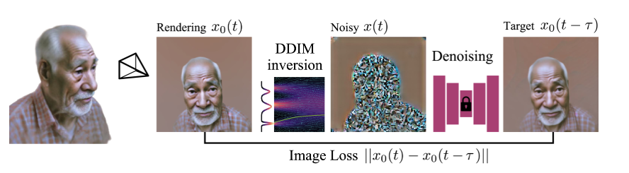

<div align=center>
  <h1>
  Score Distillation Sampling   
  </h1>
  <p>
    <b>NYCU: Image and Video Generation (2025 Fall)</b><br>
    Programming Assignment 3
  </p>
</div> 

<div align=center>
  <p>
    Instructor: <b>Yu-Lun Liu</b><br>
    TA: <b>Ying-Huan Chen</b>
  </p>
</div>

<div align=center>
  
</div>

---

## Description

Score Distillation Sampling (SDS) is a technique used in generative models (diffusion) that leverages a pretrained model to guide generation by distilling the score (how well a sample aligns with the target distribution) back into the sampling/optimization. In this assignment we focus on **text-to-image generation** with SDS and its variants **SDI** and **VSD**.

Unlike the reverse denoising process, *distillation sampling* parameterizes the target content (e.g., images) and optimizes its parameters based on a predefined loss function derived from the diffusion model’s score prediction.

---

## Setup

```bash
conda create -n lab3 python=3.9
conda activate lab3
pip install -r requirements.txt
```

---

## Code Structure

```
.
├── asset/                    # images for README (teaser, method figs)
├── data/
│   └── prompt_img_pairs.json # prompts used by eval scripts
├── guidance/
│   └── sd.py                 # implement: get_sds_loss / get_sdi_loss / get_vsd_loss
├── eval.py                   # CLIP evaluation
├── eval.sh                   # unified evaluator (SDS / SDI / VSD)
├── main.py                   # training/optimization entry
├── utils.py                  # helpers (I/O, image save)
├── requirements.txt
└── README.md
```

---

## Task 0: Introduction

Distillation sampling parameterizes the target content (e.g., images) and optimizes the parameters using the gradient of the distillation loss function $\nabla_{x^0}L$. In this assignment, we denote $c$ as a text prompt, $x^\prime$ as a noisy sample, $\epsilon$ as a random sample from a standard Gaussian distribution, and $\epsilon_\theta(\cdot, \cdot, \cdot)$ as a pretrained diffusion model that predicts the noise in the input.

We focus on **text-to-image generation** using diffusion distillation methods (no editing tasks). For inference, use `data/prompt_img_pairs.json`, which contains test prompts for evaluation. For each task, implement the corresponding loss function in `guidance/sd.py`. Use a fixed guidance scale for each task: **25 for SDS/SDI and 7.5 for VSD**.

---

## Task 1 — Score Distillation Sampling (SDS) [20 pts]

<p align="center">

</p>

Score Distillation Sampling distills gradients from a pretrained diffusion model by comparing the predicted and sampled noises:

$$
\nabla_{x^0} L_{\text{sds}} = \mathbb{E}*{t,,\epsilon}\big[,\epsilon*\theta(x^t, c, t) - \epsilon,\big]
$$

### ✅ TODO

Implement `get_sds_loss()` in `guidance/sd.py`.
The function receives the latent image $x^0$, text embedding $c$, and optionally `guidance_scale` used for the Classifier Free Guidance weight (CFG).
It should return the computed SDS loss.

### 💻 Run Command

```bash
python main.py --prompt "${PROMPT}" --loss_type sds --guidance_scale 25
```

---

## Task 2 — Score Distillation via Inversion (SDI) [30 pts]

<p align="center">

</p>

Score Distillation via Inversion (SDI) improves SDS stability by performing **DDIM inversion** before computing score differences:

$$
\nabla_{x^0} L_{\text{sdi}} = \mathbb{E}*{t,,\epsilon}\big[,\epsilon*\theta(x^t, c, t) - \epsilon_{\text{inv}},\big]
$$

### ✅ TODO

Implement `get_sdi_loss()` in `guidance/sd.py`.
The function reconstructs the forward path using DDIM inversion and compares the predicted noise with the inverted noise $\epsilon_{\text{inv}}$.
Return the computed SDI loss.

### 💻 Run Command

```bash
python main.py --prompt "${PROMPT}" --loss_type sdi --guidance_scale 25
```

---

## Task 3 — Variational Score Distillation (VSD) [30 pts]

<p align="center">

</p>

Variational Score Distillation introduces a **LoRA-parameterized UNet** to reduce the discrepancy between the pretrained model and optimized latents:

$$
\nabla_{x^0} L_{\text{vsd}} = \mathbb{E}*{t,,\epsilon}\big[,\epsilon*\theta(x^t, c, t) - \epsilon_{\phi}(x^t, c, t),\big]
$$

where $\phi$ are LoRA parameters.

### ✅ TODO

Implement `get_vsd_loss()` in `guidance/sd.py`.
The function should compute the difference between pretrained and LoRA noise predictions and return the combined latent and LoRA loss.

### 💻 Run Command

```bash
python main.py --prompt "${PROMPT}" --loss_type vsd --guidance_scale 7.5 --lora_lr 1e-4 --lora_loss_weight 1.0
```

Refer to `data/prompt_img_pairs.json` for `prompt`.

---

## Evaluation

Use the unified evaluation script `eval.sh`:

```bash
bash eval.sh --sds
bash eval.sh --sdi
bash eval.sh --vsd --guidance 7.5
```

Each command will:

1. Generate results for all default prompts.
2. Remove intermediate step images.
3. Run CLIP evaluation automatically and save final results to:

```
./outputs/{loss_type}/
├── <prompt>.png
└── eval.json
```

---

## What to Submit

Submit `{STUDENT_ID}_lab3.zip` containing:

```
./submission/
├── guidance/sd.py
├── outputs/{sds,sdi,vsd}/ + eval.json
└── report.pdf
```

### Report (20 pts)

* **Explain SDS, SDI, and VSD — both the concept and your implementation (code).**
* **Compare visual and CLIP results.**
* **Intuitively analyze** why SDI improves stability and why VSD improves fidelity and diversity (**without heavy math**).
* **Discuss** the influence of hyperparameters (guidance scale, steps, learning rate, LoRA rank).

---

## Grading

| Component    | Points  | Description                           |
| ------------ | ------- | ------------------------------------- |
| Task 1 – SDS | 20      | Correct implementation + results      |
| Task 2 – SDI | 30      | Correct implementation + results      |
| Task 3 – VSD | 30      | Correct implementation + results      |
| Report       | 20      | Clear analysis, comparisons, insights |
| **Total**    | **100** |                                       |

### CLIP Score Thresholds

| CLIP Score | SDS (20 pts) | SDI/VSD (30 pts) |
| ---------- | ------------ | ---------------- |
| ≥ 0.28     | Full credit  | Full credit      |
| 0.26–0.28  | 75% credit   | 25 pts           |
| 0.24–0.26  | 50% credit   | 20 pts           |
| < 0.24     | 0            | 0                |

---

## Rules

* Modify **only** `guidance/sd.py`.
* Plagiarism → automatic zero.

---

## References

* [https://github.com/KAIST-Visual-AI-Group/Diffusion-Assignment4-Distillation/tree/main](https://github.com/KAIST-Visual-AI-Group/Diffusion-Assignment4-Distillation/tree/main)
* [DreamFusion: Text-to-3D using 2D Diffusion](https://arxiv.org/abs/2209.14988)
* [ProlificDreamer: Variational Score Distillation](https://arxiv.org/abs/2305.16213)
* [Score Distillation via Inversion (SDI)](https://arxiv.org/abs/2312.02164)
